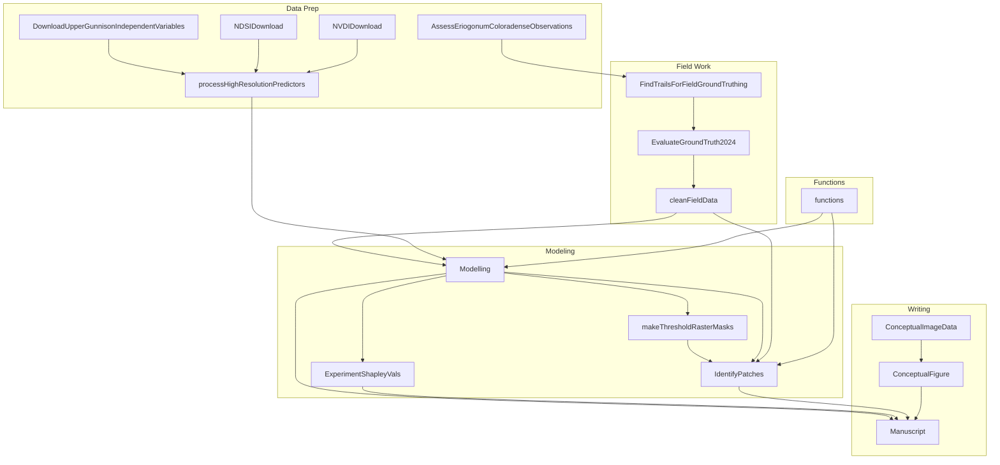

## Eriogonum coloradense occurrence data set

These data were collected in the Summer of 2024. 
The goals for sample design were to: 
  1) Revisit all known *E. coloradense* populations - allowing statistical inference to be made to the species. 
  2) Collect tissue from more than 15 (preferably 20 individuals) per population visited
  3) Ideally do this in one season

goals were not meet - however I came quite close. check the data for deats.  

The data set was intended for use in exploring landscape genomics studies; in particular the effects of topographic isolation on plant population differentiation since a tentatively recent glacial event. 
A core aspect of this is understanding the isolation of populations, effective population census size, and -leaning out on a branch - reconstructing at historic time intervals habitat suitability and distances between patches. 

The way these data were collected allowed for optimization of species distribution models (ecological niche models). 
Facets of SDM's which present research opportunities around this time include: using predicted habitat suitability as  variate to use in predicting plant density. 
Using high resolution independent variables which could allow for spatially explicit SDM predictions to be thresheld to the boundaries of a population. 
And finally providing some directional metrics to help prioritize field campaigns which seek to discover new plant populations using the results of SDMs. 

Additional questions relating to the use of block (& spatial) cross-validation, and the effects of sample size and independent variable resolution on modelling efforts, are readily possible with the data set too - given the very high number of occurrences. 

### Iterative Adaptive Modelling 

beneath needs update re-validation ~~~ Jun 12 2025 ~~~

Goals:

1) Evaluate the differences between species distribution models at different resolutions (1/3, 1, and 3 arc-second) on both held-out and ground verified data [AUC-ROC, AUC-PR, Sens., Spec., TSS].  
2) Estimate spatial plant counts across species domain, using XGBoost, and lightGBM with Poisson and Tweedie distributions.  
3) Estimate population census sizes using a variety of metrics for determining a binary cutoff for P/A classifications (1) from a probabilistic estimate. In the parlance of dismo::treshold, equal sensitivity and specificity (true positive rate = true negative rate), specificity - sensitivity (value which maximizes clasification accuracy?), and sensitivity which presumably relates to the lowest value which maximizes true positives. Then combining these population areas, with the count predictions (2). 
4) Model occupancy of suitable habitat patches (3) as a function of distance from an occupied patch (both euclidean and least-cost), and patch characteristics (e.g. area).  
5) Compare the results of a Mature plant presence versus a Juvenile plant presence model, are the important variables similar? 
6) Simulate the effects of sample size on model performance using the data set generated after both rounds of field sampling.  
7) Simulate the effects of occurrence record geolocation accuracy on model performance using the data set generated after both rounds of field sampling.  

## Workflow

Many scripts are used, they can be separated into a few modules. 
These include:  
- **data prep** which focuses on cleaning historic data '*Assess Eriogonum coloradense Observations*', and generating independent variables '*Download Upper Gunnison Independent Variables*' and '*process High Resolution Predictors*' along with the '*NDSI download*' and '*NVDI download*' scripts.  
- **field work** includes both planning, '*Find Trails For Field Ground Truthing*' ,  and cleaning the field data '*Evaluate Ground Truth 2024*', '*clean Field Data*'
- **modelling** includes ... '*Identify Patches*', '*make threshold raster masks*', '*Experiment Shapley Vals*'. 
- **writing** includes both the '*Conceptual Image Data*' & '*Conceptual Figure*' and '*Manuscript*'



## Domain

The area of analysis is roughly 10 miles out from a minimum convex hull which can encapsulate all known occurrences. 

```geojson
{
  "type": "FeatureCollection",
  "features": [
    {
      "type": "Feature",
      "id": 1,
      "properties": {
        "ID": 0
      },
      "geometry": {
        "type": "Polygon",
        "coordinates": [
          [
              [-107.3328,38.00338],
              [-105.5631,38.00338],
              [-105.5631,39.545],
              [-107.3328,39.545],
              [-107.3328,38.00338]
          ]
        ]
      }
    }
  ]
}
```

