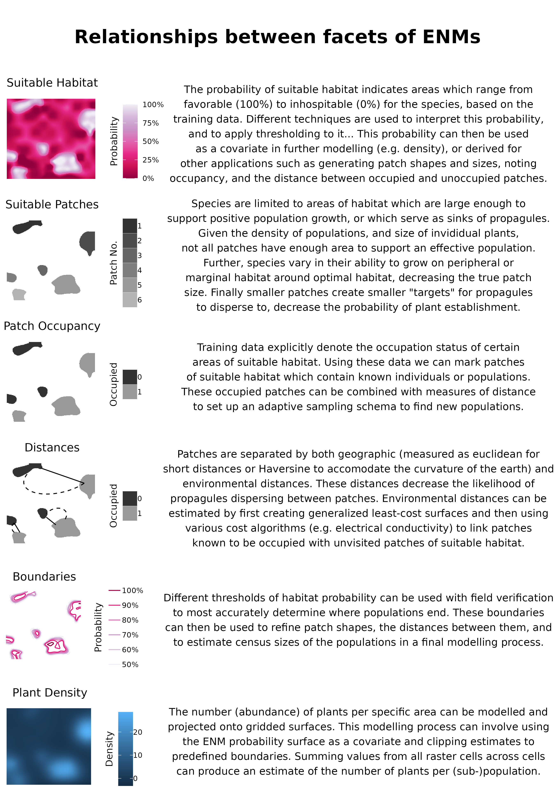

```{r setup, include=FALSE}
knitr::opts_chunk$set(echo = FALSE, warning = FALSE, message = FALSE, comment = "")
set.seed(27)
```

```{r Required Libraries, message=F, warning=F, results='hide'}
library(tidyverse)
library(bookdown)
library(knitr)
library(kableExtra)
library(patchwork)

# packages for analysis
library(caret) # general data partitioning
library(pROC)

source('theme_manuscript.R')
```

# 1 | Introduction

https://onlinelibrary.wiley.com/doi/10.1111/ele.12189
https://onlinelibrary.wiley.com/doi/full/10.1111/ddi.13795 # maybe
https://www.cell.com/trends/ecology-evolution/fulltext/S0169-5347(18)30304-5
https://www.nature.com/articles/s41559-026-03125-y # maybe

The effects of anthropogenic stressors have led to a global extinction crisis, with estimates suggesting that 20-45% of plant species are facing extinction [@bachman2024extinct; @brummitt2015green; @pimm2015many; @nic2020extinction].
Determining which plant species to focus our conservation efforts (e.g., active restoration, preserve creation, *ex situ* collections) on requires an array of natural history data seldom available to decision-makers [@heywood2017plant].
The environmental niche of a species, its occupied geographic extent, the occupancy of sites within the range, and the census size of populations are all essential attributes for evaluating a species' continued existence against anthropogenic stressors [@natural2001iucn; @faber2012natureserve; @usfws2016ssa].
Although these attributes are relatively simple to characterise, implementation is time-consuming, requiring extensive fieldwork -- hence requiring proxies for conservation assessments [@juffe2016assessing; @bland2015cost; @pelletier2018predicting].
Environmental niche models (ENMs or Species Distribution Models, SDMs) have made enormous contributions to two of these attributes, describing the realised environmental niche of a species, and the species' geographic extent within it [@syfert2014using; @anderson2023integrating; @kass2021improving].
Further, this progress - paired with a growing volume of occurrence data from citizen science platforms and the digitisation of natural history museum records - offers promise for modelling the remaining two attributes, occupancy and census size [@markham2023review; @feldman2021trends].

However, despite this progress, the utility of models is seldom field verified, especially at landscape scales [@chiffard2020anbs; @a2022species].
Despite an awareness that ENMs generally suffer from having few, often spatially biased, occurrence records as dependent variables, which often fail to characterise the ecological breadth of the species niche [@stolar2015accounting; @feeley2011keep; @pili2025correcting].
Accordingly, while many ENMs achieve high performance on hold-out test subsets, biases in the training data may be propagated into predictions [@a2022species].
Increasingly adaptive-niche-based sampling (ANBS), which generates larger data sets of both presence and absence records for training -- leading to more robust models, while possibly obtaining more data from sparsely sampled niche space.
However, most ANBS sampling has preferentially visited cells with high predicted occurrence probability [@guisan2006using]; because such cells are often close to already-known occurrences, this tests a model's easiest predictions rather than expanding its training data to better reflect the species niche.
Refitting a model with this newly acquired data not only expands the presence/absence pool ((ALLOWING BETTER PARTINIONING OF CONTRIBUTIONS OF INDEPENDENT VARIABLES)), but also verifies coordinate placement, confirms that historic points are still extant ((BOTH DECREASING RECORDS OUTSIDE THE NICHE)), reduces model uncertainty, and may yield additional data such as census estimates and life stage demographics [@stockwell2002effects; @wisz2008effects; @jansen2022stop; @mondain2024adaptive].
Ground-truthing results are, in any case, seldom shared or reported for plant species, and even less effort has apparently been made to first verify the baseline reliability of existing records for rare species specifically [@johnson2023field; @borokini2023iterative; @zimmer2023field].

The spatial grain of environmental variables has often been too coarse to model the micro-environments that govern many rare plants' distributions, especially in heterogeneous environments [@guisan2013predicting].
Accordingly, most early ENM work targeted resolutions useful for conservation policy decisions, while resolutions fine enough for natural resource professionals' individual management decisions remain nascent.
Recent advances in remote sensing, statistics, and software have narrowed this resolution mismatch [@zellweger2019advances].
Recent papers have had mixed results regarding the effects of imprecisely mapped occurrence data on ENM predictions, with indications that models generated in more heterogeneous environments, and at finer resolutions (e.g. ca. 3 arc-second to 10 arc-minutes (~14.5km at 38$^\circ$)) suffer minor decreases in model performance [@graham2008influence; @smith2023including] with real species, while increasing error in mapping has drastic effects on model predictions with virtually simulated species [@gabor2022positional].

An ENM predicts a single variable: the probability of suitable habitat for the taxon (taddeo2026diversitydistributions).
However, in most conservation applications, the insight desired from an ENM is the species' realised distribution (cite).
Significant progress has been made integrating ENM predictions with models of dispersal, recognising that the bridge between an ENM and a plant population's presence is propagule dispersal and establishment, not the distribution of the fundamental niche alone [@guisan2005predicting; @franklin2010moving; @engler2009migclim].
Previous innovations have largely focused on connecting currently suitable habitat to habitat predicted to be suitable under climate change [@engler2009migclim; @bocedi2014range], rather than on detecting populations that already exist but remain undiscovered.
To assist practitioners in detecting new populations or extending the range of known populations, we propose modelling plant occupancy as a random variable that depends on distance from known occupied sites.
'Distance' may be defined as Euclidean (or Haversine), or as a least-cost distance reflecting a generalised surface which conveys the difficulty for propagules (e.g. seeds) to travel between the nearest occupied sites and the site of interest [@etherington2016least].
By combining habitat suitability with both Euclidean and least-cost distance, we distinguish candidate sites as extensions of known populations, new sub-populations, or new populations, rather than relying on suitability alone to prioritise field verification.

Obtaining reliable estimates of plant population census sizes requires two pieces of information: 1) measurements of plant density and 2) population extent.
Observers often estimate population sizes rather than directly measuring boundaries or density, which can be unreliable and does not carry estimates of uncertainty [@ReischChristoph2018Acom].
Several field methods for acquiring density measurements have been developed [@rominger2019application; @krening2021sampling; @ermakova2021densities; @alfaro2019optimal; @schorr2013using] to estimate population census size (*N*), as well as genomic methods to estimate effective population sizes (*N~e~*) (e.g. linkage disequilibrium) [@waples2024practical].
However, these methods are focused on descriptive rather than predictive processes, estimating uncertainty in measurements *within* a population rather than across the species' range without the use of covariates.
We propose generating density estimates with spatial statistical models that predict both estimates and uncertainty across gridded surfaces [@oliver2012population; @doser2022spabundance; @a2022species].
The second requirement, mapping a population's boundaries, is similarly time-consuming but essential for an accurate census size estimate.
Currently population boundaries are delineated implicitly: practitioners walk outward from the population until gene flow between individuals should be minimal (e.g., 1km), searching for additional individuals, or rely on aerial imagery [@alma9955306914202441].
Many rare plant species are small and inconspicuous, and many taxa grow in small, clustered groups in specific habitats, making detection via either method difficult [@chen2013imperfect; @condit2000spatial].

```{r, out.width='100%', out.height='100%', fig.pos='p', fig.cap='figgy stardust'}

```

1) An ENM models the continuous probability of suitable habitat for a taxons realized niche, that is the habitat it is expected to grow to maturity in, based on known occurrences.
2) The ENMs continuous probability function is converted into a presence / absence flag using thresholds along the gradient. The threshold may try to reduce false positives, if a conservative range estimate is required, reduce false negatives for a more inclusive result, or balance these characteristics.
3) Suitable habitat in closer proximity to known occurrences is more likely to be populated, and indeed the lack of notation may simply be due to the time required to map presences, a form of the beach problem.
4) Plant density is modelled using a similar suite of covariates as an ENM, with the option to include the ENM as the variate.
5) Census size estimates are a combination of plant density throughout a population, and a populations border.

Here we: 1) evaluate the results of the best-performing model with ground truthing (within 270m of existing occurrences).
2) Compare the results of models from different resolutions to the best model, as based on hold-out test data.
3) Determine whether model predictions are useful to find new sub-populations (270m - 450m from existing occurrences), or populations (> 450m from existing occurrences).
4) Estimate population census size using 4a) estimates of plant density, and 4b) modelling of population boundaries.

# 2 | Methods

### 2.1 | Study Species & System
*Eriogonum coloradense* Small (Polygonaceae) is a synoecious, mat-forming perennial herb endemic to the south-central Rocky Mountains of Colorado, U.S.A.
Its known range spans five counties and encompasses 22 documented populations, occurring across a broad range of elevation (2700-3900m asl), slope, aspects, soil types, and habitats - from high-elevation sagebrush steppe, through subalpine grasslands, to alpine slopes.
It is ranked S3/G3 by NatureServe and listed as a Tier 2 species in Colorado Parks and Wildlife's State Wildlife Action Plan [@anderson2004eriogonum; NATURESERVE].

This taxon is largely pollinated by solitary bees, flies and butterflies, which are known to move pollen considerably shorter distances than bumble bees (i.e. 1km).

### 2.2 | Data Acquisition
Occurrence records were downloaded from iNaturalist (80 records) and the Consortium of Southern Rockies herbaria (131 records) [@inaturalist2024ecolo; @soro2024].
These data were manually reviewed, and 16 herbarium records were removed due to low geolocation quality or a georeferenced locality inconsistent with the specimen label which we could not accurately identify.

Digital elevation models (DEMs) at 3 arc (TYPE) and 1 arc (TYPE) resolution, and digital elevation products (DEPs) at 1/3 arc resolution, were acquired from the United States Geological Survey and clipped to the analytical domain, a rectangle buffered 16 km (10 mi) beyond any known population.
These elevation products were used to derive most geomorphology datasets with whiteboxTools [@wu2022whitebox], plus heat load and diurnal anisotropic heat indices calculated with spatialEco [@evans2025spatialeco].
Vegetation cover data were generated by combining raster layers into three continuous cover classes: Forested, Shrub, and Herbaceous [@tuanmu2014global].

ClimateNA was used to downscale GridMet (Cite) data to 3 arc-second resolution, which was then bilinearly interpolated to generate products at the 1 and 1/3 arc resolutions [@wang2016locally].
Gray-Level Co-occurrence Matrices (GLCM) were produced with the glcm R package from 2023 NAIP aerial imagery (CITE), bilinearly resampled to the original resolution, using default settings with a window size of 5 in both directions [@zvoleff2020glcm].

Collectively these resulted in 50 independent variables for ENM modelling.

### 2.3 | Ground Verification (H1)
```{r import iteration 1 data, echo=F}
bp = file.path('..','..', 'data', 'GroundTruthPts')
iter1_f_draw_pts = bind_rows(
  sf::st_read(file.path(bp, 'Iteration1.shp'), quiet = T), 
  sf::st_read(file.path(bp, 'Iteration1-Coechotopa.shp'), quiet = T) |>mutate(Trail = 'Coechotopa')
  )

n_iter1_f_draw_pts = nrow(iter1_f_draw_pts)

iter1_gt = sf::st_read(file.path('..', '..', 'data', 'GroundTruthing', 'Iteration1Pts.shp'), quiet = TRUE) |>
  sf::st_drop_geometry() |>
  drop_na('Lctn_bb')

# computer generated plots visited. 
plots_visited = filter(iter1_gt, str_detect(Site, 'r|p'))  # comp sim plots visited

# opportunistic data collection
iter1_gt = filter(iter1_gt, is.na(Site) | ! str_detect(Site, 'r|p')) 
opportunistic_absences = iter1_gt |> filter(Presenc == 0) |> nrow()
opportunistic_presences = iter1_gt |> filter(Presenc > 0) |> nrow()
n_comp_based_abs <- nrow(
  read.csv(
    file.path('..', '..', 'data', 'GroundTruthing', 'ComputerAbs.csv')
    )
  ) # manually entered to computer absences
```

As our taxon had not had a recent survey work carried out for a it, a first round of sampling was used to detect occurrences which would be found by a field botanist without the need of statistical modelling approaches and thereby inflate the results of our study.
The first round of ground sampling was carried out from June to September 2024.
All pre-existing occurrence points were considered candidates for revisits, and `r distinct(iter1_f_draw_pts, Trail) |>nrow()` trails leading to them were marked as sample areas.
Each trail was manually mapped and buffered by 45m in each direction; 551 random points were drawn, thinned to distances > 90m, leaving `r n_iter1_f_draw_pts` random plots for assessment.
`r nrow(distinct(iter1_gt, Lctn_bb))` trails were visited, allowing for the assessment of `r nrow(plots_visited)` random points, of which `r filter(plots_visited, Presenc > 0) |> nrow()` had new occurrence records.
When conducting fieldwork presences of *E. coloradense* were opportunistically noted to better describe the spread of the population, quadrats were quasi-randomly placed - accounting for local abundance - ca. 30-50m from the previous plot until traversing out of the population (n = `r opportunistic_presences`).
Subjectively placed absences were also collected in areas that seemed favourable or were in proximity to *E. coloradense* individuals; this occurred in the field (n = `r opportunistic_absences`).
Absences in areas known to be outside the range of the populations were also added later via aerial imagery  (n = `r n_comp_based_abs`).
At each occurrence site, individuals were counted by three maturity stages (mature, juvenile, and seedling) in 3x3m quadrats.

```{r}
rm(plots_visited, opportunistic_presences, opportunistic_absences, n_comp_based_abs, iter1_gt, iter1_f_draw_pts, n_iter1_f_draw_pts, bp)
```

### 2.4 | Comparison of Different Spatial Resolutions (H2)
Environmental niche models were generated at three spatial resolutions: 3 arc-second (~72m), 1 arc-second (~24m), and 1/3 arc-second (~8m).
The modelling details followed the same process across spatial resolutions.
Spatial data processing was largely performed in R [@rcoreteam2026r], using sf [@pebesma2018sf] and terra [@hijman2026terra], with modelling implemented with the tidymodels framework [@kuhn2020tidymodels].

Records were thinned to the distance of a hypotenuse of a cell to avoid pseudo-replicates using spThin [@aeillo2015spthin].
<!-- Benkendorf comment: this must be wrong... at least ~3.8x were generated for finest resolution. -->
1.1 times as many background absence records as presence records were generated using the environmental distance from the sdm package [@naimi2016sdm].
These records were manually reviewed, and six records in areas with possible presences were removed.
After this, the records were randomly sampled to reduce the dataset to XX records.
After the first modelling iteration, all additional presences and absences were thinned using spThin similarly and combined with the original absence records.
'Presences' with greater coordinate uncertainty than the modelling resolution were removed.

Prior to fitting, uninformative predictor variables were removed for each model using Boruta feature selection, retaining both confirmed and tentative important variables [@kursa2010boruta].
The mTry and tree-depth hyperparameter were tuned using PACKAGE ().
All random forest models were fit using the ranger package; 95% confidence intervals were generated using the infinitesimal jackknife [@wager2014confidence; @wright2017ranger].

### 2.5 | Occupancy Based Field Sampling (H3)

360 candidate ground-truthing sites and 180 oversamples were selected using a spatially balanced Generalized Random Tessellation Stratified (GRTS) design [@dumelle2024spsurvey], stratified by named site regions and allocated proportional to each region's candidate-pixel count (DEFINED AS?), which was restricted to areas which a human could safely sample.
Within each region, pixels were prioritised using a weighted combination of 1) predicted suitability, favoring the ~50% probability band; 2) Euclidean distance from known occurrences, favouring the underrepresented far tail; and 3) a cost-distance anomaly.
The cost-distance anomaly utilises within-region residuals of least-cost distance [@vanetten2017gdistance] regressed on Euclidean distance, which flags cells where terrain-based travel difficulty diverges most from straight-line expectations. 

### 2.6 | Plant Density (H4a)

Plant density was modelled using NINE? approaches, and both spatial and non-spatial cross-validation [@mila2022nearest].
Because one population (Cochetopa Dome) consistently has far higher plant counts than the others, a naive train-test split risked confounding genuine model generalisation with a simple between-population split; training and test sets were instead partitioned using data twinning on rescaled coordinates and count values, which selects a test set whose joint distribution mirrors the training set's [@vakayil2026twinning].
Five density models were fit: four using XGBoost across two distributions (Poisson, Tweedie), and one using light gradient boosting [@chen2016xgboost; @ke2017lightgbm].
Bayesian hierarchical models with poisson, zero-inflated, and hurdle distributions, with population as a fixed effect were also utilized, using a test train split on count of plants per quadrat.
Two null models served as baselines for comparison: the arithmetic mean plant count by population, and ordinary kriging interpolation across the study area [@pebesma2004gstat].

```{r Prepate Data for Final Maps}

```

### 2.7 | Population Boundaries (H4b)

Population boundaries were delineated by thresholding the continuous habitat suitability surface from the best-performing model using two different threshold-selection rules 1) sensitivity, and 2) equal sensitivity and specificity [@hijman2024dismo].
Sensitivity is the ability of a model to accurately predict occurrences at the expense of false positives, while equalizing it with specificity balances accuracy of both classes [@hijman2024dismo].
Because the sensitivity-rule polygons were nested entirely within the spec_sens-rule polygons rather than crossing them, we used the smaller (sensitivity-rule) polygon's outer edge as the baseline for transect placement, treating the band between the two polygons as the zone where the two threshold rules disagree - and the area to test which rule better represents the population's actual extent.
For each patch, we identified the smaller polygon's outer edge using native raster boundary detection (4-connected neighbours), generating candidate transects along the four cardinal directions from each edge cell.
Transects began 50m inside this edge, extended outward across the disagreement band until clearing the larger (spec_sens-rule) polygon's boundary by a further 15m, and were capped at 150m total length, so that each transect crosses both threshold boundaries and directly tests which rule better matches the field-observed edge of the population.
Patches containing a known occurrence within 100m received a size-proportional transect budget (area^0.5, floor of 3, ceiling of 12 per patch); patches without a nearby known occurrence were flagged as exploratory and given only a fixed floor of transects, kept as a separate sampling stage.
A per-site cap of 15 transects (trimming exploratory transects first) and a no-crossing constraint were applied before finalising the field sheet, which records each transect's start coordinates, true and magnetic compass bearing, and a series of stations at 10m intervals along its length.

### 2.8 | Final Models

Using occurrence, density, and boundary-transect data from both rounds of ground-truthing combined with the original records, we refit final models of habitat suitability, occupancy, and census size, evaluating each solely against a held-out subset of the ground-truthed data not used in any prior training or tuning step.

## 3 | Results

### 3.1 | Ground Verification (H1)

```{r Best Model Groundtruthing Evaluation}
# TODO: results for best-performing model evaluated against groundtruthing (within 270m of existing occurrences).
```

Within 270m of the known occurrences, the model had a PR-AUC of XX, indicating they can model the species fundamental niche.
The differences between resolutions varies by XX-XX, with 3-arc second models' performance likely inflated due to a trump ruling where absences near presences are removed for evaluation.

```{r Held-out vs Field-validated Pr-AUC Placeholder, out.width='100%', fig.width=8, fig.height=4.5}
## PLACEHOLDER: synthetic data previewing the layout for held-out vs.
## field-validated Pr-AUC of the single best model per resolution, split
## into the two ground-verification phases: H0 (fit on pre-existing
## occurrence records only) and H1 (refit after incorporating the first
## round of ground-truthing). Swap the synthetic tibble below for the real
## one, with the same Resolution/Phase/Heldout/Field columns, once
## field-validated Pr-AUC is computed for both phases.
res_levels <- c('3 arc-second', '1 arc-second', '1/3 arc-second')  # coarse (bottom) -> fine (top)

heldout_field_mock <- tibble(
  Resolution = factor(rep(res_levels, each = 2), levels = res_levels),
  Phase      = factor(rep(c('H0', 'H1'), times = length(res_levels)), levels = c('H0', 'H1')),
  Heldout    = c(0.79, 0.83,  0.84, 0.87,  0.76, 0.79),
  Field      = c(0.55, 0.71,  0.62, 0.80,  0.48, 0.62)
) |>
  pivot_longer(c(Heldout, Field), names_to = 'Set', values_to = 'PrAUC') |>
  mutate(Set = factor(Set, levels = c('Heldout', 'Field'), labels = c('Held-out', 'Field-validated')))

ggplot(heldout_field_mock, aes(y = Resolution, x = PrAUC, color = Phase, group = interaction(Resolution, Phase))) +
  geom_line(position = position_dodge(width = 0.5), color = 'grey70', linewidth = 0.6) +
  geom_point(aes(shape = Set), position = position_dodge(width = 0.5), size = 3, stroke = 1.1) +
  scale_shape_manual(values = c('Held-out' = 1, 'Field-validated' = 16)) +
  scale_color_phase() +
  scale_x_continuous(limits = c(0, 1)) +
  labs(x = 'Area under the precision-recall curve', y = NULL, shape = NULL, color = 'Phase',
       title = '(mock) H1 - Held-out vs. field-validated Pr-AUC, best model per resolution') +
  theme_manuscript()
```

### 3.2 | Comparison of Different Spatial Resolutions (H2)

```{r Predicted Probability of Occurrence Correlations, eval = F}

```

The 1/3 arc-second model (n = obs plot, n = obs opportunistic) has a PR-AUC of, 1 arc ... , 3 arc.
If 'removing' the points not compared in the 3arc model the 1 arc PR-AUC becomes, and removing the points not compared in the 1 and 3 arc second models the 1-3 arc model has THIS pr-auc.
Across both modelling runs, the (non-)spatial CV model diagnostics were more like the ground truthed data.

```{r PA-ratio Sensitivity, out.width='100%', fig.width=10, fig.height=4.2}
res_labels <- c(`10` = '1/3 arc-second (~8m)', `30` = '1 arc-second (~24m)', `90` = '3 arc-second (~72m)')

read_paratio_search <- function(fp, split) {
  f <- list.files(fp, pattern = '^[0-9]+-PAratio-search[.]csv$', full.names = TRUE)
  tibble(File = f, Split = split) |>
    mutate(
      Resolution = factor(gsub('-PAratio-search.*$', '', basename(File)), levels = names(res_labels)),
      Data = lapply(File, read_csv, show_col_types = FALSE)
    ) |>
    unnest(Data) |>
    select(-File)
}

paratio <- bind_rows(
  read_paratio_search(file.path('..', '..', 'results', 'tables'), 'Spatial'),
  read_paratio_search(file.path('..', '..', 'results', 'results_classicsplit', 'tables'), 'Classic')
) |>
  mutate(
    Resolution = factor(Resolution, levels = names(res_labels), labels = res_labels),
    Split = factor(Split, levels = c('Spatial', 'Classic')),
    ratio_label = factor(round(ratio, 2))
  ) |>
    filter(ratio <= 4)

## Occurrence/absence sample sizes per resolution, read directly from the
## presence files each PA-ratio search was built on (absences here are only
## each file's own baked-in absences - NOT the shared iter1 absence pool
## that adaptive_PAratio_search() also draws from, since that pool
## ('iter1-pa.gpkg') isn't available in this data checkout). Falls back to
## 'XX' per-resolution when a presence file is missing (e.g. the 1/3
## arc-second presence-iter1 file doesn't exist yet).
sample_sizes <- function(res_key) {
  f <- file.path('..', '..', 'data', 'Data4modelling', paste0(res_key, 'm-presence-iter1.gpkg'))
  if (!file.exists(f)) return(c(occ = NA_integer_, abs = NA_integer_))
  d <- sf::st_read(f, quiet = TRUE)
  c(occ = sum(d$Presenc == 1, na.rm = TRUE), abs = sum(d$Presenc == 0, na.rm = TRUE))
}
sizes <- sapply(names(res_labels), sample_sizes)
size_labels <- tibble(
  Resolution = factor(res_labels[names(res_labels)], levels = res_labels),
  label = paste0(
    'Occurrences: ', ifelse(is.na(sizes['occ', ]), 'XX', sizes['occ', ]),
    '\nAbsences: ', ifelse(is.na(sizes['abs', ]), 'XX', sizes['abs', ])
  )
)

ggplot(paratio, aes(x = ratio_label, y = metric, color = Split, fill = Split, shape = Split)) +
  geom_boxplot(aes(group = interaction(ratio_label, Split)),
               position = position_dodge2(width = 0.7, preserve = 'single'),
               alpha = 0.25, outlier.shape = NA, linewidth = 0.4) +
  geom_point(position = position_jitterdodge(jitter.width = 0.12, dodge.width = 0.7), size = 1.6, alpha = 0.8) +
  geom_text(data = size_labels, aes(x = -Inf, y = Inf, label = label),
            inherit.aes = FALSE, hjust = -0.05, vjust = 1.3, size = 3, lineheight = 0.9) +
  facet_wrap(~Resolution, ncol = 3, scales = 'free_x') +
  scale_color_split() +
  scale_fill_split() +
  scale_shape_split() +
  labs(x = 'Presence:Absence Ratio', y = 'Pr-AUC', color = 'Train/test split', fill = 'Train/test split', shape = 'Train/test split') +
  theme_manuscript()
```

The area under the precision-recall curve (AUC-PR), the True Skill Statistic, and Sensitivity and Specificity [@sofaer2019area; @allouche2006assessing].

### 3.3 | Occupancy Based Field Sampling (H3)

```{r Sub-population Detection Table}
# Detail the Number of sub populations detected at each iteration.
```

X sub-populations (occurrences found between 270-450m) were detected while field sampling.
No new populations were detected during sampling.
The latter indicating that the species geographic distribution is well defined.
A zero-inflated logistic model identifies that Euclidean distance has X contributions, while the cost-distance anomaly surface has X contribution.

### 3.4 | Plant Density (H4a)

```{r Regression of Plant Density Observed and Predicted Plot, eval = FALSE}
## NOTE: kept for reference - written around the PA-ratio comparison, which
## is being dropped for this section, and doesn't yet have a field-validated
## MAE series. Needs reworking before this goes back into the doc; see the
## placeholder chunk below for the intended layout in the meantime.
fp = file.path('..', '..', 'results','count_models','tables')
f = file.path(fp, list.files(fp, pattern = 'csv'))

ab_models = tibble(File = f) |>
    mutate(
      Run_Info = gsub('[.]csv', '', basename(File)),
      Resolution = factor(gsub('arc.*$', '', Run_Info), levels = c("1-3", "1", "3")),
      PresAbsRatio = as.numeric(gsub('^.*PA1_', '', Run_Info))
      ) |>
    mutate(Data = lapply(File, read_csv, show_col_types = FALSE)) |>
    unnest(Data) |>
    mutate(Model = str_replace(Model, 'Arithmatic', 'Arithmetic')) |>
    select(-File) |>
    filter(Metric == 'MAE')

ggplot(ab_models, aes(x = PresAbsRatio, y = Value, color = Model, group = Model)) +
  geom_point(size = 5) +
  geom_smooth() +
  facet_wrap(~Resolution, ncol = 3) +
  theme_minimal() +
  labs(y = 'Mean Absolute Error (Number of Plants per quadrat)')
```

Predictive results were compared with n field visited plots (n = sample draw, n = opportunistic).
The inflation of MAE by modelling ranged from (X -- Y), and the average difference between the spatial and non-spatial CV folds was XX, indicating that CV FOLDS LEAD TO OPTIMISTIC results.

```{r Plant Density Held-out vs Field-validated MAE Placeholder, out.width='100%', fig.width=8, fig.height=3.5}
## PLACEHOLDER: synthetic data previewing the layout for held-out vs.
## field-validated MAE of the XGBoost Tweedie model (the headline density
## model), split by spatial vs. non-spatial cross-validation. Swap for the
## real chunk once field-validated MAE is computed.
res_levels <- c('3 arc-second', '1 arc-second', '1/3 arc-second')  # coarse (bottom) -> fine (top)

mae_mock <- tibble(
  Resolution = factor(rep(res_levels, each = 2), levels = res_levels),
  CV         = factor(rep(c('Non-spatial', 'Spatial'), times = length(res_levels)), levels = c('Non-spatial', 'Spatial')),
  Heldout    = c(6.8, 10.6,  7.9, 13.0,  6.5, 9.8),
  Field      = c(8.8, 12.6,  10.1, 16.2,  7.8, 12.2)
) |>
  pivot_longer(c(Heldout, Field), names_to = 'Set', values_to = 'MAE') |>
  mutate(Set = factor(Set, levels = c('Heldout', 'Field'), labels = c('Held-out', 'Field-validated')))

ggplot(mae_mock, aes(y = Resolution, x = MAE, shape = CV, group = interaction(Resolution, CV))) +
  geom_line(position = position_dodge(width = 0.5), color = 'grey70', linewidth = 0.6) +
  geom_point(aes(fill = Set), position = position_dodge(width = 0.5), size = 3, stroke = 1.1) +
  scale_shape_manual(values = c('Non-spatial' = 21, 'Spatial' = 24)) +
  scale_fill_manual(values = c('Held-out' = 'white', 'Field-validated' = 'black')) +
  guides(fill = guide_legend(override.aes = list(shape = 21))) +
  labs(x = 'Mean Absolute Error (plants / 3m^2 quadrat)', y = NULL, shape = 'CV', fill = NULL,
       title = '(mock) H4a - XGB Tweedie: held-out vs. field-validated MAE') +
  theme_manuscript()
```

### 3.5 | Population Boundaries (H4b)

```{r Population Boundary Results}
# TODO: results for modelling population boundaries.
```

The population boundaries obtained by thresholding resulted in initial estimates of population geographic extent of ... for sensitivity and for equal sensitivity and specificity.
The wombling approach shows that estimates at the XX-percentile led to more accurate estimates of population extent, correcting it towards YY.

### 3.6 | Final Results

```{r Final Suitability Map, out.width='100%'}
## Title/subtitle, extent-box letter tags, the shifted+padded coche box,
## north-arrow placement, and larger legend are all implemented in
## maps.qmd (verified against the real single-run test raster in its
## 'Theme preview' section). Still blocked on real data:
##   - the binary sens/spec_sens cut overlay and the iter0-vs-iter1 diff
##     appendix panel both need rasters that don't exist yet (see the
##     TODOs in maps.qmd's 'Final Suitability and Density Maps' and
##     'Suitability Iteration Diffs Appendix' chunks).
img <- file.path('figures', 'suitability_final.png')
if (file.exists(img)) knitr::include_graphics(img)
```

```{r Final Density Map, out.height='40%'}
## Title/subtitle, the km-not-m scale bar fix on panels B/D/F, and shared
## extents on A/C/E (by construction - see maps.qmd) are implemented. Still
## open: whether the B/D/F zoom crops need an actual named-locality label
## beyond the region name they already carry - flagged in maps.qmd, not
## guessed here.
img <- file.path('figures', 'density_final.png')
## dpi = NA: skip knitr's auto width-from-pixel-size calculation, so only
## out.height constrains the figure and LaTeX scales width proportionally
## (otherwise a fixed, often page-overflowing width gets forced alongside
## out.height).
if (file.exists(img)) knitr::include_graphics(img, dpi = NA)
```

```{r Suitability Map Theme Preview, out.width='100%'}
img <- file.path('figures', 'suitability_preview.png')
if (file.exists(img)) knitr::include_graphics(img)
```

```{r Density Map Theme Preview, out.height='50%'}
img <- file.path('figures', 'density_preview.png')
if (file.exists(img)) knitr::include_graphics(img, dpi = NA)
```

## 4 | Discussion

Be sure to mention --

1) the iNaturalist records found outside the niche of the species.
    a) Relate bias of RF to this.
2) Field area was selected to best represent amount of field sampling time available to crews, which often must travel considerable distances day of sampling to reach populations.
    a) However, area is one of the best characterised alpine ecosystems globally due to its proximity to the Rocky Mountain Biological Laboratory.
3) While very high-resolution spatial data are becoming increasingly available, they may not be required for assessment of many species' niches, and existing standard of YADA YADA for naturserve is still valuable.
4) Every approach generates estimates of statistical uncertainty, albeit some (infinitesimal jackknife) are highly time intensive.

## 5 | Conclusions

ENMs have proven themselves an essential tool for conservation planning.
Recent advances in statistical and remote sensing have extended this utility to land management decisions.
Here we showed that ENMs can also be elaborated upon to model other attributes essential for conservation planning and land management decisions such as census size estimates.
We provide a framework for occupancy modelling and further exemplify the utility of spatial cross-validation in predictive modelling.
Our work re-iterates the value of citizen science, exemplified here by the discovery of populations by three individuals on iNaturalist outside of the predictions of our biased models -- and which the lead author would certainly not have visited without their observations.
Finally, we hope that others build upon our data sets using an ANBS approach with this taxon, as our 'final' results are simply another hypothesis yet to be tested.

## 6 | Author Contributions

R.C.B.: Conceptualization, Data curation, Formal analysis, Investigation, Methodology, Software, Visualization, Writing.
S.T. and J.B.F.: Writing.
All authors read, revised and approved the final manuscript.

### Acknowledgments

Hannah Lovell, and Phoebe Roberts, are thanked for assistance with field work in 2026.
Julia R. Benkendorf is thanked for editorial services.
The following individuals are thanked for uploading multiple iNaturalist observations that were used in modelling: Rick Williams, Rosemary Smith, John Powers.
Both XXX, YYY, and ZZZ are thanked for observations that greatly extended the niche of *E. coloradense*.
Savannah Smith (?) is thanked for verifying the placement of an undocumented population.

### Funding

The authors have no funding to report.

### Conflicts of Interest

The authors declare no conflicts of interest.

### Data Availability Statement

All analysis code, and occurrence data are available on GitHub at [REPO URL]. While the individual fitted models, 3arc resolution predictors, and raster surface predictions, are archived on Zenodo [DOI].

### Appendix

1) More informative predictors, or large sample sizes? How does accuracy change in light of occurrence number
2) High leverage observations influencing uncertainty in ENM predictions.
3)

\singlespace

### References