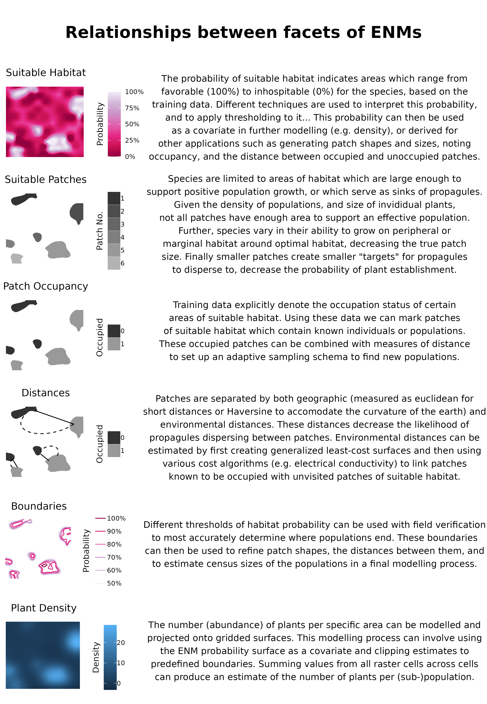

```{r setup, include=FALSE}
knitr::opts_chunk$set(echo = F, warning = F, message = F)
set.seed(27)
```

```{r Required Libraries, message=F, warning=F, results='hide'}
library(tidyverse)
library(bookdown)
library(knitr)
library(kableExtra)

# packages for analysis
library(caret) # general data partitioning 
library(pROC)
```


# 1 | INTRODUCTION

The effects of anthropogenic stressors, e.g. land use and climate change, have lead to a global extinction crisis with estimates of the number of plant species facing extinction ranging from 20-40% (@brummitt2015green, @pimm2015many, @nic2020extinction). 
Determining which plant species to focus our conservation efforts (e.g. active restoration, preserve creation, *ex situ* collections) on requires an array of data which seldom exist for decision makers (@heywood2017plant). 
These data generally outline simple biological and ecological parameters of species useful for detailing there rarity and how it's distribution relates to current and future anthropogenic stressors. 
Chief amongst these parameters, are the geographic extent of occurrence (range), the distribution of suitable habitat - the occupancy of this habitat as well as the spacing of occupied patches, and the census size of individual (sub-)populations (@natural2001iucn, @faber2012natureserve, @usfws2016ssa). 
While these parameters are relatively simple, characterizing them can be time consuming, generally requiring extensive field work and travel to field sites - hence they oftentimes require proxies or heuristics for estimation in conservation assessments (@juffe2016assessing, @bland2015cost, @pelletier2018predicting). 
Environmental niche models (ENMs or Species Distribution Models SDMs) have made enormous and respectable headway, respectively, in resolving the former two problems (extent, and occupancy) (@syfert2014using, @anderson2023integrating, @kass2021improving), however the historic mismatch between the resolution of variables governing species distributions and the data available to serve as predictors of environmental conditions have restricted the interpretation and implementation of these models in highly heterogeneous environments (@guisan2013predicting). 
Recent advances in remote-sensing technologies have allowed for the generation of useful models in these generally biodiverse systems, further these data offer promise to model additional population parameters (e.g. census size, population extents), however the utility and usage of high resolution have rarely been ground verified or ostensibly reported upon (@chiffard2020anbs). 

Recently, considerable headway has been made in generating statistically robust environmental niche models (ENM's) spirited by: recent advances in collecting high-resolution environmental data, compute power, digitization of natural history museum records and the acquisition of citizen science records, and statistical methods especially downsampling (@markham2023review, @feldman2021trends).  
However, ENM's are rarely ground verified, and even more seldom at landscape scales (@a2022species).
Hence, most of our knowledge about producing ENM's rely on simulated species and data, especially at spatial resolutions considered relatively coarse to practitioners.  
An historic complication with the implementation and interpretation of ENM's is a mismatch between the spatial resolution of the independent variables available to model the species fundamental niche and the factors governing the true distribution of populations - the realized niche (@carscadden2020niche, @chauvier2022resolution, @lembrechts2019incorporating). 
Recent papers have had mixed results regarding the effects of imprecisely mapped occurrence data on ENM predictions, with indications that models generated in more heterogenous environments, and at finer resolutions (e.g. ca. 3 arc-second relate to 10 arc-minutes (~14.5 km) at 38*)) suffer minor decreases in model performance (@graham2008influence, @smith2023including) with real species, while increasing error in mapping has drastic effects on model predictions with virtually simulated species (@gabor2022positional).  
A further mismatch of resolution is the year in which data on geographic localities were obtained and current conditions which allow for positive population growth (@bracken2022maximizing). 
Historic occurrence data may now represent conditions which are inhospitable to the maintenance of populations, or may even represent populations which even then were simply sinks from more robust populations (@bracken2022maximizing); using these records may decrease model performance. 
Collecting data on whether areas are favorable to continued recruitment of individuals from the soil seed bank, are perhaps more astute than whether long-lived individuals persist.  

ENM models generally suffer from having few, generally spatially biased, occurrence records to serve as dependent variables, which generally fail to characterize the ecological breadth of the species (@stolar2015accounting, @feeley2011keep). 
While many ENM's have high-performance metrics while tested on small subsets of hold-out data, they are unlikely to detect many new populations during ground verification (@a2022species). 
To increase the number of presences, and absences in sites which are relatively similar to those harboring presences, which can be used for training models iterative adaptive-niche based sampling (ANBS) has become increasingly employed (@guisan2006using). 
In ANBS cells predicted to have high probabilities of occurrence, or where models have higher prediction uncertainty, are preferentially visited, and after each bout of field visits, a new model is fit incorporating the original data, plus the recently collected data (@mondain2024adaptive).  
Using this process not only allows for the acquisition of a larger number of presences and absences, but also allows for verifying coordinate placement, that historic points are still extent, reducing model uncertainty, and for the acquisition of additional data such as census estimates and life stages (@stockwell2002effects, @wisz2008effects, @jansen2022stop). 
However, few studies have reported field verified ANBS sampling efforts of plant species (@johnson2023field, @borokini2023iterative, @zimmer2023field).  

An ENM predicts a single variable; the probability of suitable habitat for the taxon (taddeo2024grimes). 
Although, in most conservation applications, the insight desired from an ENM is the species realized distribution (@cite).  
The bridge between an ENM and a plant populations presence is related to the dispersal of propagules and the establishment of the population, rather than distribution of the fundamental niche alone (@engler2009migclim).   
Calls - and significant progress, have been made for better integration of SDM predictions with models of dispersal  since the rise in popularity of ENM's (@guisan2005predicting, @franklin2010moving). 
Most of this progress focuses on the goal of 'connecting' currently suitable to habitat predicted to be suitable under climate change scenarios (@engler2009migclim, @bocedi2014range). 
Accordingly, ground verification has not been made for them, nor has as much effort seemingly been made in attempting to simply improve ground-verification for rare species... 
To assist practitioners in detecting new populations, or extending the range of currently known populations, we propose modelling plant occupancy as a random variable dependent on distance from sites known to be occupied, the size and shape of the target site, and it's relation to other suitable habitats.  
In a simple sense these perspectives link habitat suitability with the tenets of island biogeography (@).  'Distance' may be defined as euclidean (or Haversine for large distances), or as a least-cost distance reflecting a generalized surface which conveys the difficulty for seeds to travel between the nearest occupied sites and the site of interest (@etherington2016least).  
Landscape metrics postulated to relate to the occupancy at a site include the patch metrics Core Area Index, roughly reflecting the probability of a propagule arriving to a larger patch, and the class metrics proximity and contagion both of which reflect the aggregation between occupied sites.  

Obtaining reliable estimates of plant population census sizes can be time intensive process because it requires two major pieces of information 1) measurements of plant density and 2) population extent. 
In lieu of directly determining either the populations boundaries, or density, observers estimate population sizes, however these estimates are often unreliable (@ReischChristoph2018Acom). 
Several promising field methods for acquiring density measurements have recently been developed (@rominger2019application, @krening2021sampling, @ermakova2021densities, @alfaro2019optimal, @schorr2013using) to better estimate effective population census size (*N*), as well as progress in the application of genomic methods to estimate effective population sizes (*N~e~*) (e.g. linkage disequilibrium) (@waples2024practical). 
However these methods are focused on descriptive, rather than predictive processes, where they focus on estimating the uncertainty in measurements *within* a population, rather than across the species range. 
We propose that estimates of plant density are best generated via methods which allow for the fitting of statistical models, which can incorporate spatial covariates and predict estimates and measurements of uncertainty across gridded surfaces (@oliver2012population, @doser2022spabundance, @a2022species). 

```{r}

```

Mapping the boundaries of a population is another time consuming, albeit essential task for realistic estimates of population census size.  
Currently, population boundaries are implicitly delineated by practitioners walking distances beyond which gene flow between individuals should be minimal (e.g. 1km) searching for additional individuals, or via aerial imagery (@alma9955306914202441).  
Many rare plant species are small and inconspicuous, and many taxa grow in small clustered groups in specific habitats, making detection via either method difficult (@chen2013imperfect, @condit2000spatial). 
High resolution spatial data eventually offer an ability to determine the extent of individual populations via detection of the edges of suitable habitat. 

# 2 | METHODS

### Study Species & System 
*Eriogonum coloradense* Small (Polygonaceae) is a synoecious mat forming perennial herb endemic to the Central Southern Rocky Mountains in Colorado, U.S.A. 
It's known geographic range covers XX km^2^, with 26 formally described populations, and it is thought to occur across a range of elevation, slopes, aspects, soil types and habitats. 
It's elevation range spans xx - xx m, and the major habitat types it's known from include: high elevation sagebrush steppe, sub-alpine grasslands, and alpine slopes. 
It is considered an S3/G3 species by NatureServe, and a Tier 2 species by State Wildlife Action Plan by the Colorado Parks and Wildlife Service. 

### Data Acqusition 
Dependent data were gathered from iNaturalist (80 records) and the Consortium of Southern Rockies herbaria (131 records) (@soro2024, INATURALIST). 
These data were manually reviewed and 16 herbarium records which had low geolocation quality, or which were georeferenced to localities which did not match their herbarium labels were removed.  

Digital Elevation Models at 3arc (type), and 1arc (type), and Digital Elevation Products at 1/3 arc, and 1m, resolution were acquired from the United States Geological Survey and clipped to the domain of analysis (a rectangle buffered 16km (10 mi). beyond any known population). 
A 3m resolution digital elevation model, which is not available at a native resolution from the USGS for this area, was created by bilinear resampling of the 1m and 10m data. 
1m resolution data were only available for roughly XX% of the domain (which contained %% of known populations), the remainder of the species domains 3m data was created by linear resampling of the 10m DEP, a comparison of these results in the overlapping region are present in appendix xx. 
These elevation products were used to create all geomorphology data sets using whiteboxTools (@wu2022whitebox). 
Vegetation cover data were made by combining the raster data into continuous covers: Forested, Shrub, and Herbaceous vegetation @tuanmu2014global.  

ClimateNA was used to create a data set at 3 arc-second resolution which then underwent simple bilinear interpolation to generate products at the finer resolutions (@wang2016locally). 
Gray co-occurrence level matrices were produced using the glcm r package using 2023 NAIP aerial imagery, which underwent bilinear resampling to each resolution, using default setting but with windows of 5 in both directions (@zvoleff2020glcm). 

### Ground Verification

The first round of ground verification was carried out from June-September 2024. 
All pre-existing occurrence points were considered candidates for revisits and all 24 trails leading to them were marked as SAMPLE UNITS. 
Each trail was manually mapped, and buffered 45m in each direction and XXX random points were drawn, thinned to distances > XXXm, leaving XXX random plots for assessment. 
XX trails were visited, allowing for the assessment of XX random points and XX occurrences. 
When conducting field work, all presences of *E. coloradense* were opportunistically noted, and to better describe the spread of the population points were subjectively placed, with consdirations of local abudance, ca. 30-50m from the previous one until traversing out of the population (n = ). 
Additionally subjectively placed absences were also collected in areas which seemed favorable, or were in close proximity, to *E. coloradense* individuals; this occurred both in field (n = ) and through use of aerial imagery on a computer afterwards (n = ). 

Adaptive Niche-Based Sampling was carried out in July of 2025. 
To determine whether adaptive sampling performed better than alternative sampling regimes (e.g. stratified, random), and if it could be improved by occupancy modelling 30 points were selected for each of the aforementioned sampling schema plus 30 occupancy points. 


### Comparision of Different Spatial Resolutions  

Environmental Niche Models were generated at four spatial resolutions, 3 (~72m), 1 (~24m), and 1/3 (~8m) arc-seconds, and 3m.  
The details of modelling were similar for each resolution. 

Records were thinned to the distance of an hypotenuse of a cell to avoid replicates (@aeillo2015spthin). 
1.1 times as many Absence, as presence, records were generated using the background function with method environmental distance from sdm (@naimi2016sdm), these records were then manually reviewed and six records which were deemed in areas which may be possible presences were removed, after this the records were randomly sampled to reduce the data set size to XX records.  
After the first iteration of modelling all additional presences and absences were thinned via a similar manner and combined with the original absence records. 
'Presences' which had greater coordinate uncertainty than the resolution of modelling were removed. 

All random forest models were fit using the ranger package, 95% confidence intervals were generated using the infinitesimal jackknife (@wager2014confidence, @wright2017ranger). 
The generation of CI's for the 3m data set were not considered feasible and their prediction was omitted. 

```{r Compare Models at Different Spatial Resolutions, eval = F}

## lines ## 90m = 3 (dotted), 30m = 4 (dot dash), 10m = 2 (solid) 
## CIs ## 90m = 3 (dotted), 30m = 4 (dot dash), 10m = 2 (solid)  
## colors ## 90m = #003F5C, 30m = #ff6361, 10m = #58508d, 3m = #bc5090 
## points ## 90m = #003F5C66, 30m = #ff636166, 10m = #58508d66, 3m = #bc509066 
## CI lines ## 90m = #003F5CCC, 30m = #ff6361CC, 10m = #58508dCC, 3m = #bc5090CC 

## Create 3 regression plots, 1m res predicts the other resolutions. 

## sample the 1m prediction, 
m1_samp <- terra::sample(m1, method = 'stratified', xy = TRUE, size = 5000)

# now ensure points are > 130 m from each other to accommodate the 3 arc data set. 
st_as_sf(m1_samp, coords = c(x = 'X', y = 'Y'), crs = 32613) 
st_nearest_feature() # identify points which are closest to each other. 
st_distance() # measure the distances 
# filter for only one record within the distance. 
```

### Adaptive and Occupancy Based Field Sampling  

500 stratified points ranging from 1-100% probability of suitable habitat were generated using sample (terra). 
Occupancy scores for each of these points were then calculated using (whiteboxtools). 
200 points which maximized the spread of values along both dimensions (habitat, occupancy) were then chosen for ground verification.  

```{r Create Table of final ENM Results with number of plots with presences}

```

### Plant Density  

Plant density was modelled using five methods, a generalized linear model (GLM) with a poisson error distribution and spatial autocorrelation structures, spAbundance, Random Forest and XgBoost regression. 

```{r Regression of Plant Density Observed and Predicted}

```

```{r Prepate Data for Final Maps}

```

### Species Occupancy  

```{r Multiple Logistic Regression for Habitat Occupancy, eval = F}

Occupancy$Class <- relevel(Occupancy$Class, ref = 0)

index <- createDataPartition(Occupancy$Class, p = .70, list = FALSE)
train <- Occupancy[index,] 
test <- Occupancy[-index,] 

nnet::multinom()
```

## Comparision of Juvenile and Mature Plant Models

Using the top performing model resolution () models were refit using only either juvenile or mature plant presences, the number of mature presences were limited to the number of juvenile occurrences. 
Models were fit at 6 sample sizes (n = 15, 30, 50, 75, 125, 200) 15 times each using a randomly sampled 60%-40% train-test split of data. 

```{r Simulate Model Performance at different Lifestages, eval = F}

```

## Simulations of Sample Size 

The effect of sample size on model performance was simulated at 8 sample sizes (n = 15, 30, 50, 75, 125, 200, 300, 400) each 25 times, using a randomly sampled 60%-40% train-test split of data. 

```{r Simulate Model Performance at different Sample Sizes}

```

## Simulations of Coordinate Errors 

The effect of sample size on model performance was simulated at 6 sample sizes (n = 15, 30, 50, 75, 125, 200), with three proportions of records in error (0%, 5%, 10%, 20%), and 3 levels of coordinate uncertainty (0m, 10m, 100m, 1000m), at each of the 5 resolutions 25 times. 

```{r Simulate Model Performance with different amounts, and proportions of Coordinate Inaccuracies}

```

## 3 | RESULTS  

### Comparision of Different Spatial Resolutions  

```{r Predicted Probability of Occurrence Correlations, eval = F}

cor()
res_comparision <- data.frame(
 m1 = seq(1:100), 
 m3 = jitter(seq(1:100), 1), 
 arc1_3 = jitter(seq(1:100), 2),
 arc1 = jitter(seq(1:100), 3),
 arc3 = jitter(seq(1:100), 4)
) |>
  pivot_longer(m3:arc3, names_to = 'Resolution', values_to = 'Predicted')

par(pty="s")
plot(
  y = res_comparision$Predicted, x = res_comparision$m1, frame.plot = FALSE,
  pch=1, col = 'grey15', xlim = c(0,100), ylim = c(0,100),
  main = "Correlation Between 1m and Coarser Resolution Predictions",
  xlab = "Predicted Probability of\nSuitability Habitat", 
  ylab = "Predicted Probability of\nSuitability Habitat (1m)"
)
axis(side = 1)
abline(m3_mod, col = '#bc5090', lty = 1); abline(arc1_3_mod, col = '#58508d', lty = 2)
abline(arc1_mod, col = '#ff6361', lty = 4); abline(arc3_mod, col = '#003F5C', lty = 3)

# text(25, 5, paste0("r = ", round(kendallTau[["estimate"]][["tau"]], 3)))
dev.off()
```

```{r Evaluation Metrics Table}

```

```{r AUC-ROC and Cumulative Sum Suitable Habitat Plot}
```

The area under the receiver operating curve (AUC-ROC) and precision-recall curve (AUC-PR), the True Skill Statistic, and Sensitivity and Specificity (@sofaer2019area, @allouche2006assessing).


### Ground Verification   

```{r Ground Verification Table}
# Detail the Number of sub populations detected at each iteration. 
```

### Plant Density  

```{r Regression of Plant Density Observed and Predicted Plot}

```

```{r Maps of Suitable Habitat Density and Occupancy predictions}

```

### Species Occupancy  

```{r Multiple Logistic Regression Table}
```


## Comparision of Juvenile and Mature Plant Models

## Simulations of Sample Size 

```{r Boxplot of different Sample Sizes Simulations}

```

## Simulations of Coordinate Errors 

```{r Boxplot of Observed Coordinate Uncertainty}

```

```{r Boxplot of different Coordinate Error Simulations}

```

## 4 | DISCUSSION 

## 5 | CONCLUSIONS 

## 6 | ACKNOWLEDGMENTS 

## REFERENCES 